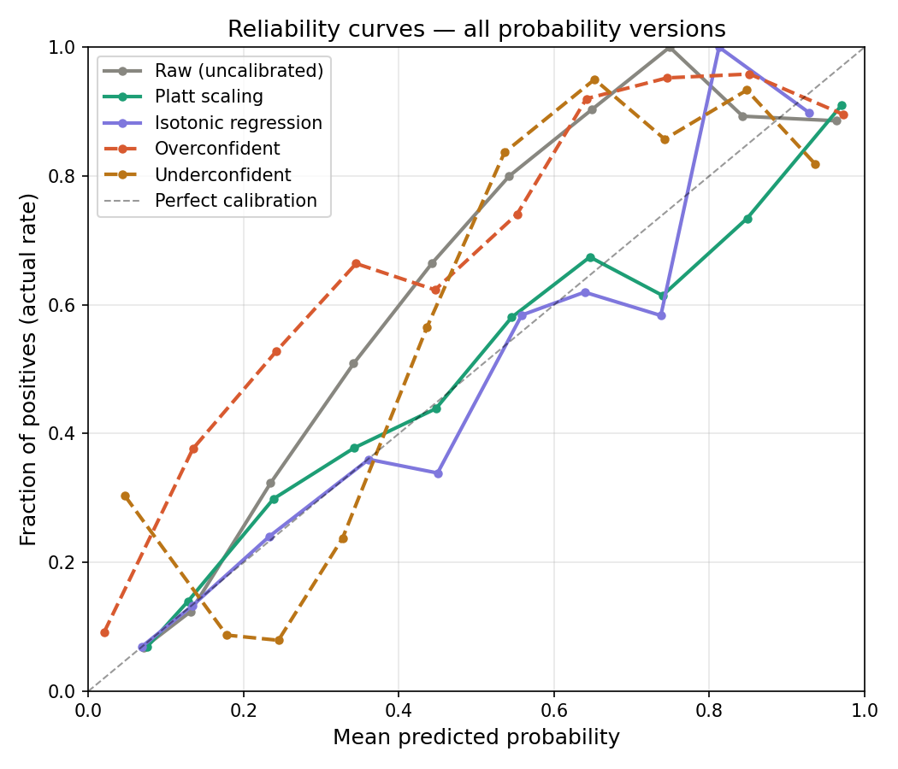
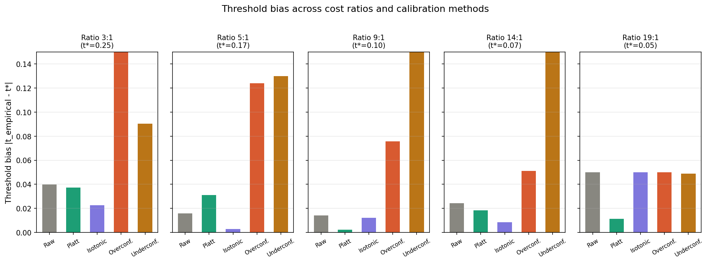
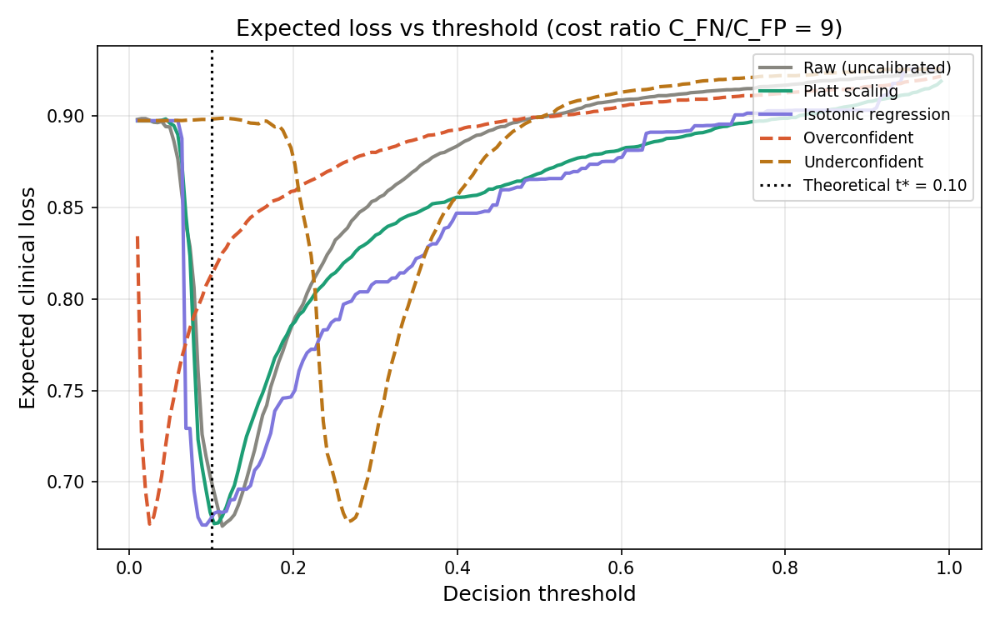
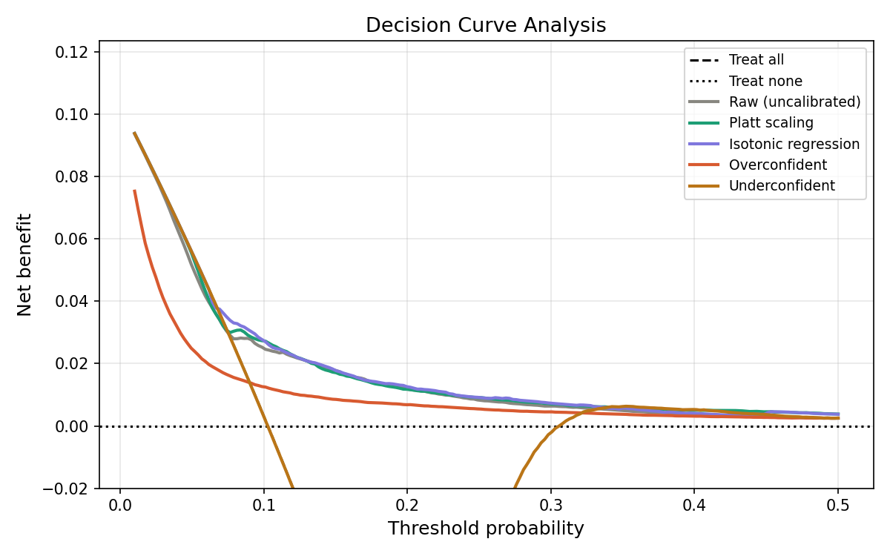
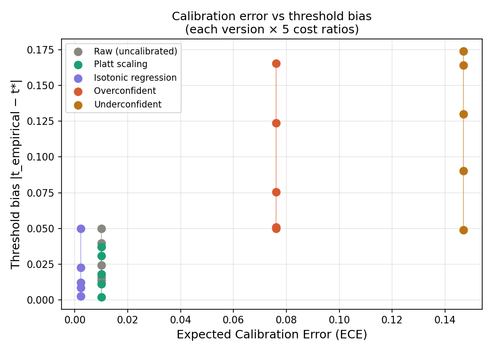

# Optimal Decision Thresholds for Clinical Risk Prediction Models Under Calibration Uncertainty

A decision-theoretic analysis of how miscalibrated probabilities shift
optimal clinical decision thresholds and increase expected patient harm —
empirically validated on 55,653 ICU patients from MIMIC-III.

---

## Table of Contents

- [Overview](#overview)
- [Key Findings](#key-findings)
- [Project Structure](#project-structure)
- [Data](#data)
- [Pipeline](#pipeline)
- [Results](#results)
- [Figures](#figures)
- [How to Run](#how-to-run)
- [Requirements](#requirements)
- [Citation](#citation)

---

## Overview

Clinical risk models output a probability score — say, 0.7 — which is
meant to represent a patient's true risk of a given outcome. A clinician
(or automated system) then applies a decision threshold: treat patients
above it, monitor those below.

The theoretically optimal threshold under asymmetric costs is:

```
t* = C_FP / (C_FP + C_FN)
```

where `C_FN` is the cost of missing a true case (false negative) and
`C_FP` is the cost of a false alarm (false positive). This formula
assumes the model's probabilities are **perfectly calibrated** — that
a score of 0.7 truly reflects a 70% risk.

In practice, they almost never are.

This project asks a question that the existing literature has not formally
answered:

> **How much does calibration error shift the optimal decision threshold,
> and how much does that shift increase expected clinical harm?**

We train a logistic regression model on MIMIC-III ICU mortality data,
evaluate five probability versions (uncalibrated, Platt-scaled, isotonic
regression, overconfident, underconfident), and measure threshold bias
and expected clinical loss across five clinically motivated cost ratios.

---

## Key Findings

| Finding | Number |
|---|---|
| Patients in study cohort | 55,653 |
| In-hospital mortality rate | 10.3% |
| Model AUROC (cross-validated) | 0.82 |
| Max loss increase — overconfident (ratio 14:1) | **33.4%** |
| Max loss increase — underconfident (ratio 5:1) | **102.7%** |
| Platt scaling bias reduction at ratio 9:1 | **84%** |
| Best average calibration method | Isotonic regression (ECE = 0.002) |

**The headline result:** At a cost ratio of 5:1 (missing a death costs
5× more than a false alarm), an underconfident model more than **doubled**
expected clinical harm compared to using the optimal threshold. Platt
scaling reduced threshold bias by 84% at the clinically critical 9:1 ratio.

---

## Project Structure

```
Healthcare-Research/
│
├── data/
│   ├── raw/                      
│   │   ├── ICUSTAYS.csv
│   │   ├── ADMISSIONS.csv
│   │   └── CHARTEVENTS.csv
│   └── processed/
│       ├── cohort.csv              
│       ├── predictions.csv         
│       └── calibrated.csv          
│
├── scripts/
│   ├── 01_load_data.py             
│   ├── 02_train_model.py           
│   ├── 03_calibrate.py             
│   ├── 04_threshold_analysis.py    
│   └── 05_evaluate.py              
│
├── results/
│   ├── threshold_results.csv       
│   └── final_metrics_table.csv     
│
├── figures/
│   ├── reliability_curves.png
│   ├── threshold_bias_summary.png
│   ├── cost_vs_threshold.png
│   ├── calibration_error_vs_threshold_bias.png
│   └── decision_curves.png
│                 
├── references.bib                 
└── requirements.txt
```

---

## Data

**Source:** MIMIC-III Clinical Database v1.4 (PhysioNet)

Access requires credentialing through PhysioNet
(`physionet.org/content/mimiciii/1.4/`). Data files are not included
in this repository.

**Cohort construction:**
- First ICU stay per hospital admission only (prevents data leakage)
- Features: mean of 7 vital signs in first 24 hours of ICU admission
- Label: in-hospital mortality (`HOSPITAL_EXPIRE_FLAG`)
- Final cohort: **55,653 patients**, mortality rate **10.3%**

**Features:**

| Feature | Missing Rate |
|---|---|
| Heart rate | 0.3% |
| Systolic BP | 12.4% |
| Diastolic BP | 12.4% |
| Respiratory rate | 12.4% |
| Temperature (°C) | 20.6% |
| SpO2 | 12.4% |
| Glucose | 11.0% |

Missing values imputed with column-wise medians.

---

## Pipeline

Run scripts in order. Each script saves its output so the next one
picks up where it left off.

```
01_load_data.py
    Reads ICUSTAYS, ADMISSIONS, CHARTEVENTS from MIMIC-III.
    Extracts first-24h vital sign averages per ICU stay.
    Output: data/processed/cohort.csv

02_train_model.py
    Trains logistic regression with 5-fold cross-validation.
    Produces out-of-fold probability estimates (no data leakage).
    Output: data/processed/predictions.csv

03_calibrate.py
    Applies Platt scaling and isotonic regression (cross-validated).
    Introduces controlled overconfident and underconfident distortions.
    Output: data/processed/calibrated.csv
             figures/reliability_curves.png

04_threshold_analysis.py
    For each probability version × cost ratio:
      - Computes theoretical optimal threshold t*
      - Finds empirical optimal threshold by minimising expected loss
      - Measures threshold bias and loss increase
    Output: results/threshold_results.csv
             figures/cost_vs_threshold.png
             figures/threshold_bias_summary.png

05_evaluate.py
    Computes AUROC, Brier score, ECE, avg bias, avg cost increase.
    Runs Decision Curve Analysis.
    Output: results/final_metrics_table.csv
             figures/decision_curves.png
             figures/calibration_error_vs_threshold_bias.png
```

---

## Results

### Model Performance

| Metric | Value |
|---|---|
| AUROC | 0.82 |
| Brier Score (raw) | 0.086 |

### Summary Metrics Per Probability Version

| Version | AUROC | Brier Score | ECE | Avg Threshold Bias | Avg Cost Increase (%) |
|---|---|---|---|---|---|
| Raw (uncalibrated) | 0.6496 | 0.0863 | 0.0101 | 0.0288 | 4.22 |
| Platt scaling | 0.6499 | 0.0856 | 0.0100 | 0.0200 | 1.96 |
| Isotonic regression | 0.6513 | 0.0854 | 0.0022 | 0.0192 | **0.62** |
| Overconfident | 0.6496 | 0.0925 | 0.0761 | 0.0932 | 26.65 |
| Underconfident | 0.6496 | 0.1080 | 0.1469 | 0.1214 | 40.45 |

Isotonic regression achieves the lowest ECE (0.0022) and lowest average
cost increase (0.62%) across all cost ratios. All three calibrated versions
(raw, Platt, isotonic) share the same AUROC — calibration does not affect
discrimination, only probability accuracy.

### Threshold Bias and Loss Increase — Full Table

| Cost Ratio | t\* | Version | t Empirical | Threshold Bias | Loss Increase (%) |
|---|---|---|---|---|---|
| 3:1 | 0.250 | Raw | 0.2102 | 0.0398 | 1.79 |
| 3:1 | 0.250 | Platt | 0.2128 | 0.0372 | 0.70 |
| 3:1 | 0.250 | Isotonic | 0.2727 | 0.0227 | 0.54 |
| 3:1 | 0.250 | Overconfident | 0.0845 | 0.1655 | 4.80 |
| 3:1 | 0.250 | Underconfident | 0.3403 | 0.0903 | **65.24** |
| 5:1 | 0.167 | Raw | 0.1510 | 0.0157 | 0.48 |
| 5:1 | 0.167 | Platt | 0.1357 | 0.0310 | 1.03 |
| 5:1 | 0.167 | Isotonic | 0.1637 | 0.0029 | 0.21 |
| 5:1 | 0.167 | Overconfident | 0.0427 | 0.1239 | 9.16 |
| 5:1 | 0.167 | Underconfident | 0.2966 | 0.1299 | **102.65** |
| 9:1 | 0.100 | Raw | 0.1140 | 0.0140 | 4.03 |
| 9:1 | 0.100 | Platt | 0.1022 | 0.0022 | 0.78 |
| 9:1 | 0.100 | Isotonic | 0.0879 | 0.0121 | 0.45 |
| 9:1 | 0.100 | Overconfident | 0.0244 | 0.0756 | 20.23 |
| 9:1 | 0.100 | Underconfident | 0.2640 | 0.1640 | 32.99 |
| 14:1 | 0.067 | Raw | 0.0911 | 0.0244 | 5.63 |
| 14:1 | 0.067 | Platt | 0.0850 | 0.0183 | 5.79 |
| 14:1 | 0.067 | Isotonic | 0.0752 | 0.0085 | 1.88 |
| 14:1 | 0.067 | Overconfident | 0.0157 | 0.0510 | 33.41 |
| 14:1 | 0.067 | Underconfident | 0.2405 | 0.1738 | 1.28 |
| 19:1 | 0.050 | Raw | 0.0000 | 0.0500 | 9.18 |
| 19:1 | 0.050 | Platt | 0.0387 | 0.0113 | 1.51 |
| 19:1 | 0.050 | Isotonic | 0.0000 | 0.0500 | 0.03 |
| 19:1 | 0.050 | Overconfident | 0.0000 | 0.0500 | 65.64 |
| 19:1 | 0.050 | Underconfident | 0.0010 | 0.0490 | 0.09 |

---

## Figures

### Figure 1 — Reliability Curves


Calibration curves for all five probability versions. A perfectly
calibrated model follows the dashed diagonal. Raw, Platt, and isotonic
versions track close to the diagonal. Overconfident probabilities are
pushed toward extremes; underconfident probabilities are compressed
toward 0.5.

---

### Figure 2 — Threshold Bias Across Cost Ratios


Threshold bias `|t_empirical - t*|` for each version across all five
cost ratios. Overconfident and underconfident models consistently show
the highest bias. Isotonic regression and Platt scaling reliably reduce
bias across all tested ratios.

---

### Figure 3 — Expected Loss vs Decision Threshold


Expected clinical loss as a function of decision threshold at cost ratio
9:1 (t\* = 0.10). The vertical dotted line marks the theoretical optimum.
Calibrated models (solid lines) bottom out near t\*. Miscalibrated models
(dashed) have their minima shifted — overconfident near 0.02,
underconfident near 0.26.

---

### Figure 4 — Decision Curve Analysis


Net benefit across threshold probabilities. The overconfident model
produces negative net benefit beyond ~0.15, meaning it would actively
harm patients at those decision thresholds. The underconfident model
crosses into negative territory around 0.28. All calibrated models
remain beneficial across the full clinical range and outperform the
treat-all baseline.

---

### Figure 5 — Calibration Error vs Threshold Bias


The central empirical finding. Each point represents one probability
version at one cost ratio. Higher ECE directly predicts higher threshold
bias. Calibrated versions cluster bottom-left (low ECE, low bias).
Miscalibrated versions appear top-right. This relationship holds
consistently across all five cost ratios.

---

## How to Run

### 1. Install dependencies

```bash
pip install -r requirements.txt
```

### 2. Download MIMIC-III

Request access at `physionet.org/content/mimiciii/1.4/` and download:

```bash
wget -N -c --user YOUR_USERNAME --ask-password \
  "https://physionet.org/files/mimiciii/1.4/ICUSTAYS.csv.gz"

wget -N -c --user YOUR_USERNAME --ask-password \
  "https://physionet.org/files/mimiciii/1.4/ADMISSIONS.csv.gz"

wget -N -c --user YOUR_USERNAME --ask-password \
  "https://physionet.org/files/mimiciii/1.4/CHARTEVENTS.csv.gz"

gunzip *.csv.gz
```

### 3. Set your MIMIC path

Open `scripts/01_load_data.py` and update:

```python
MIMIC_PATH = "/path/to/your/mimic-iii"
```

### 4. Run the pipeline

```bash
python scripts/01_load_data.py          # ~15 min
python scripts/02_train_model.py        # ~2 min
python scripts/03_calibrate.py          # ~1 min
python scripts/04_threshold_analysis.py # ~1 min
python scripts/05_evaluate.py           # ~1 min
```

Or upload `main.tex`, `references.bib`, and the `figures/` folder
to Overleaf (`overleaf.com`) and compile there.

---

## Requirements

```
pandas>=1.5.0
numpy>=1.23.0
scikit-learn>=1.1.0
matplotlib>=3.6.0
```

---

## Limitations

- Seven vital sign features only — more comprehensive feature sets
  may yield different calibration characteristics
- Controlled miscalibration is synthetic, not from natural distributional
  shift
- Logistic regression only — results may differ for gradient boosted
  trees or neural networks
- Threshold optimisation becomes unstable at extreme cost ratios (≥19:1)
  as t\* approaches the lower bound of predicted probabilities

---

## Acknowledgements

Data from the MIMIC-III Clinical Database (PhysioNet). Access requires
credentialing and signing the PhysioNet Data Use Agreement.
